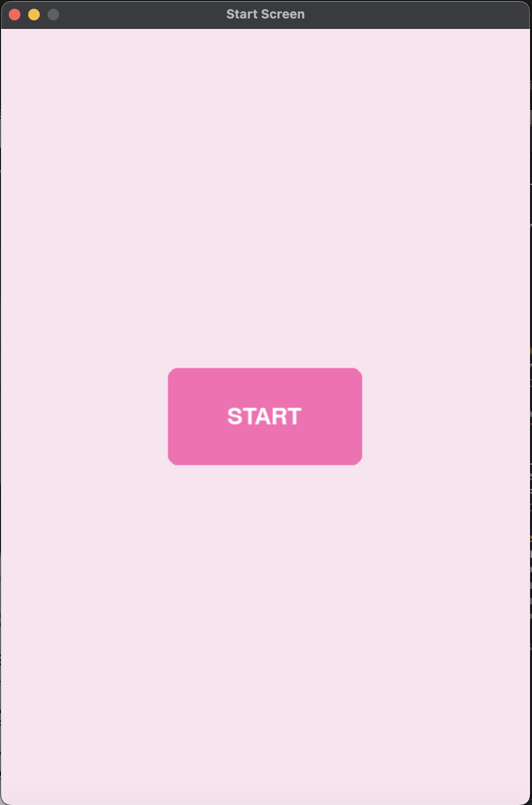
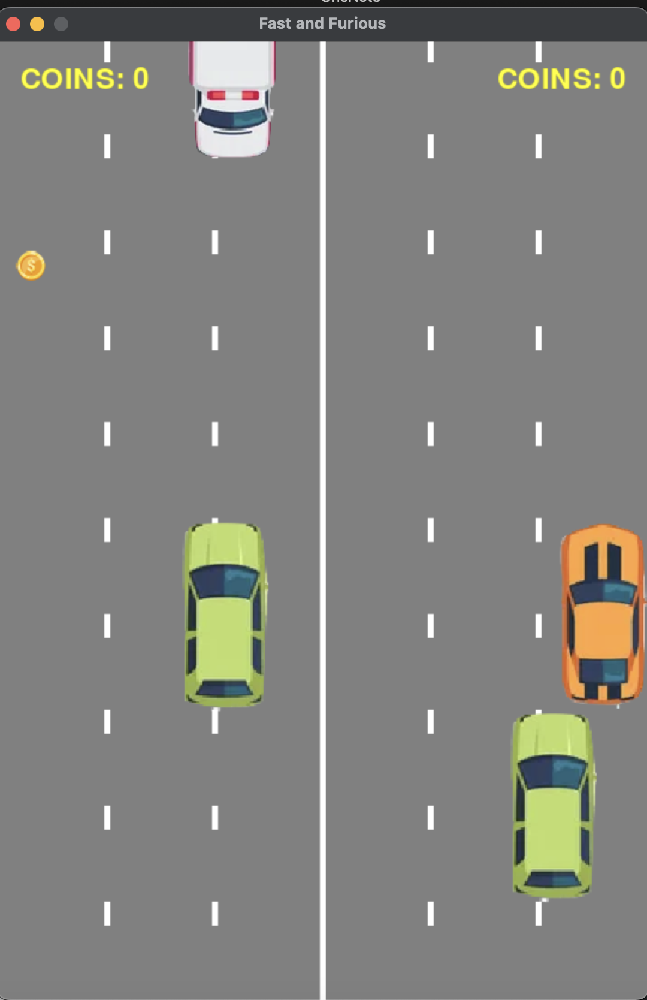
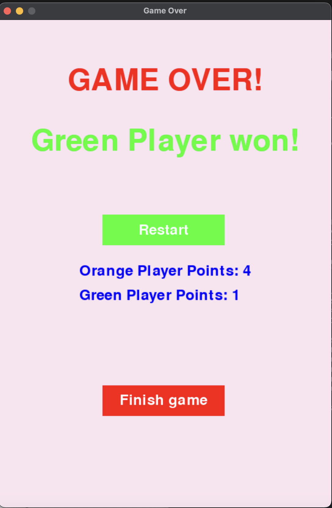

# Fast and Furious - multiplayer game

Fast and Furious to prosta gra wyścigowa stworzona w języku Python z wykorzystaniem biblioteki Pygame.  Gra umożliwia rozgrywkę dla dwóch graczy, którzy rywalizują o wygrana. Polega na sterowaniu samochodami i zbieraniu pieniędzy na drodze, unikając przy tym kolizji z innymi pojazdami.

## Jak uruchomić grę?

1. Upewnij się, że masz zainstalowaną bibliotekę Pygame. Jeśli nie, możesz ją zainstalować za pomocą pip:

   ```
   pip install pygame
   ```

2. Po zainstalowaniu Pygame, uruchom plik `game.py`.

## Wątki:
Reprezentują różne aspekty gry, które muszą działać równolegle. Wszystkie te wątki działają równolegle, co pozwala na rozgrywkę gry z wieloma interakcjami pomiędzy obiektami na ekranie.

### Road

Główny wątek gry, zarządza logiką gry, włączając w to wyświetlanie ekranu startowego, obsługę zdarzeń, aktualizację graczy oraz zarządzanie innymi wątkami.

### CashThread

Wątek odpowiedzialny za generowanie pieniędzy (obiektów "Cash") na ekranie w losowych miejscach. Pieniądze pojawiają się co jakiś czas i znikają po zebraniu przez gracza.

### CarThread

Generuje samochody (obiekty "Car") na ekranie. Samochody poruszają się w dwóch kierunkach i mają losowe prędkości. Nowe samochody pojawiają się co pewien czas.

### PlayerCollision

Sprawdza kolizje pomiędzy graczami. Jeśli gracze się zderzą, wątek ten przesuwa graczy, aby uniknąć nakładania się na siebie.

### Collision

Sprawdza kolizje pomiędzy samochodami na drodze. Jeśli dwa samochody zderzą się, wątek ten odpowiednio je przesuwa, aby uniknąć nakładania się na siebie.

### RemoveCashThread

Usuwa pieniądze, które zostały zebrane przez graczy. Kiedy gracz zebrał pieniądz, ten wątek usuwa go z ekranu.


## Stosowane sekcje krytyczne:
Reprezentują różne aspekty gry, które muszą działać równolegle. Wszystkie te wątki działają równolegle, co pozwala na rozgrywkę gry z wieloma interakcjami pomiędzy obiektami na ekranie.

### Mutex dla listy samochodów (CarThread) 
Wątek generujący samochody (CarThread) korzysta z mutexu, aby synchronizować dostęp do listy samochodów. Mutex zapewnia, że tylko jeden wątek naraz może dodawać nowe samochody do listy, co eliminuje możliwość konfliktów przy dostępie do wspólnego zasobu.

### Mutex dla listy pieniędzy (CashThread) 
Podobnie jak w przypadku samochodów, wątek generujący pieniądze (CashThread) korzysta z mutexu, aby synchronizować dostęp do listy pieniędzy na drodze. Dzięki mutexowi zapewniamy bezpieczny dostęp do tej listy, eliminując możliwość równoczesnego dostępu przez wiele wątków.
## Instrukcje gry:

- Po uruchomieniu gry, możesz rozpocząć grę, klikając przycisk "Start".
- Sterowanie:
  - Gracz 1:
    - Góra: Strzałka w górę
    - Dół: Strzałka w dół
    - Lewo: Strzałka w lewo
    - Prawo: Strzałka w prawo
  - Gracz 2:
    - Góra: Klawisz "W"
    - Dół: Klawisz "S"
    - Lewo: Klawisz "A"
    - Prawo: Klawisz "D"
- Celem gry jest zbieranie pieniędzy na drodze, unikając kolizji z innymi samochodami. 
- W pojedynczej grze pieniądze otrzymuje tylko gracz, którego auto wygrało. 
- Gra kończy się, gdy którykolwiek z graczy stłucze swój samochód. 
- Po zakończeniu gry możesz zrestartować grę lub zakończyć działanie programu. 
- Wyniki zapisywane są do pliku tekstowego "baza.txt". Możesz tam kontrolować, kto wygrywa w kolejnych rozgrywkach.

## Zdjęcia z gry:

{width=400px}
*Ekran startowy gry*

{width=400px}
*Gameplay*

{width=400px}
*Ekran zakończenia gry*

## Autorzy:

- Klaudia Marzec
- Zakia Shefa 


